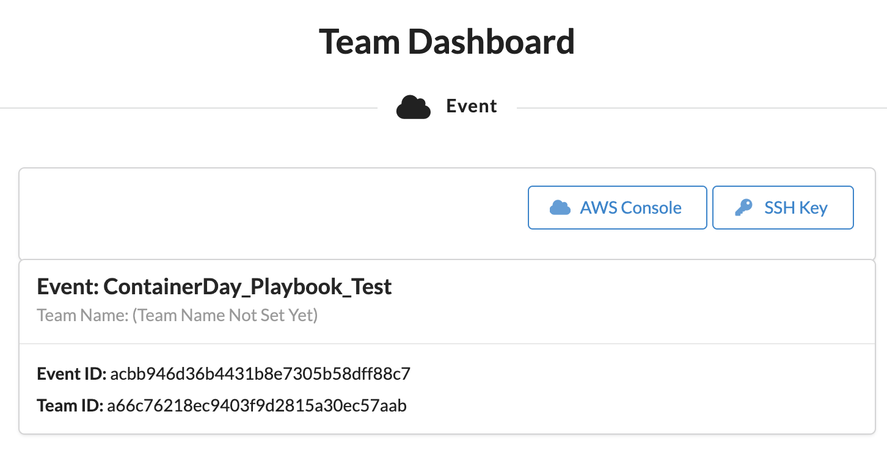
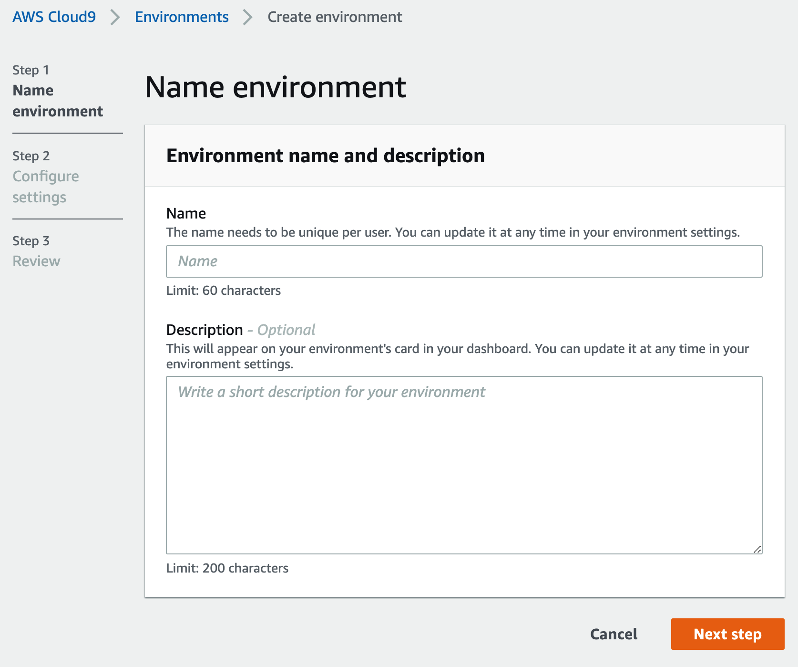
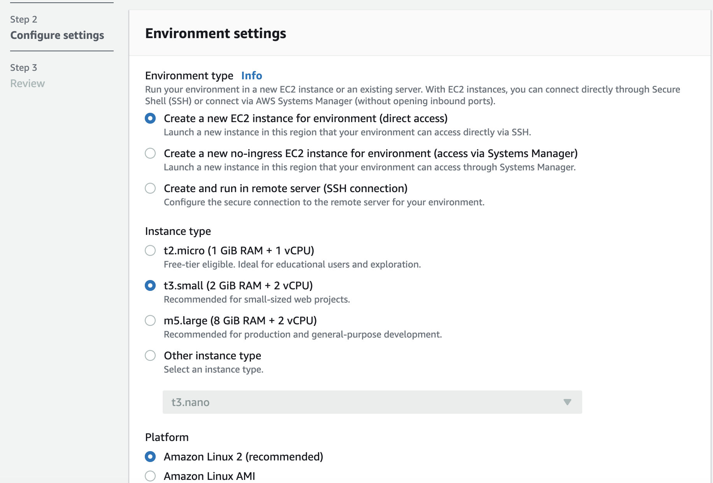
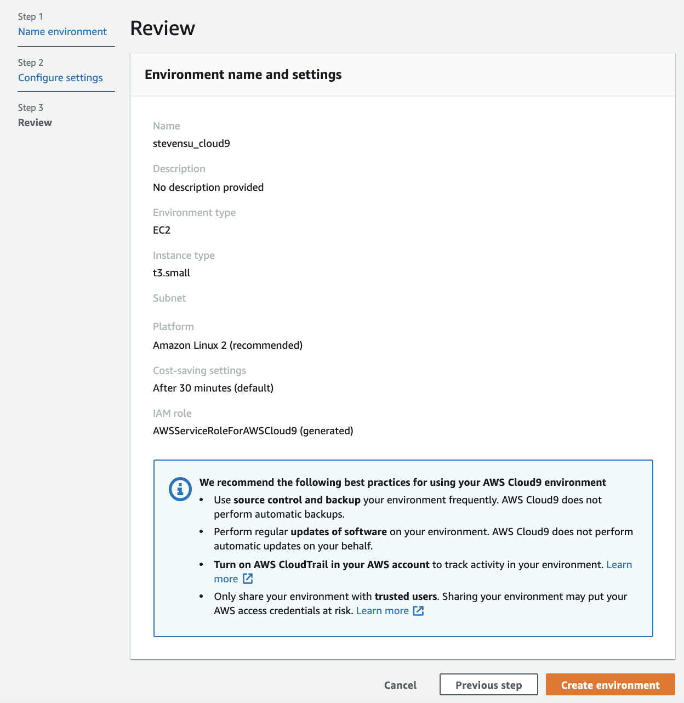
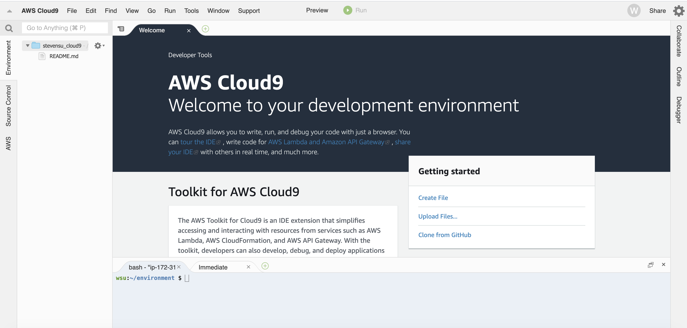
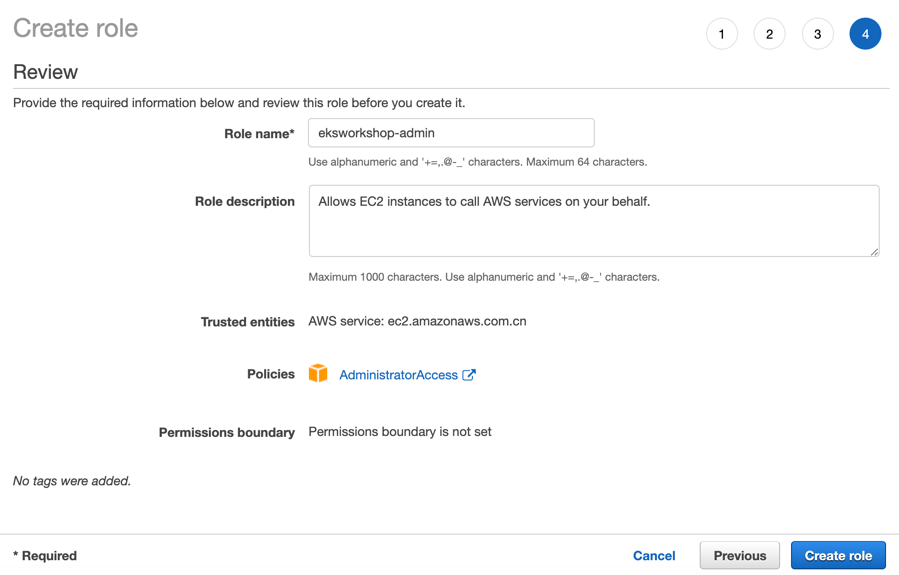
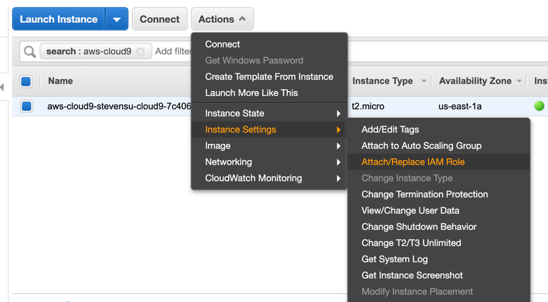

# Lab1 实验环境准备


## 通过 AWS Cloud9 搭建开发环境
AWS Cloud9 为您提供了EC2基础设施资源并且一个可视化的编辑器。在本次实验中，您将通过Cloud9去创建一台具有公网访问权限的EC2 实例，运行后续的实验。

### 登录 EventEngine
通过浏览器进入 https://dashboard.eventengine.run/ ,填入12位hash code



输入邮箱接收一次性登陆验证码

通过点击AWS Console , Open AWS Console 进入aws 控制台


### 创建 Cloud9 开发环境 

打开AWS管理控制台，在屏幕右上角的区域下拉列表中确认当前区域是**Oregon（us-west-2）**，在Service菜单栏中输入关键字Cloud9，进入Cloud9 管理页面


点击Create environment,在Environment name and Description内输入 环境的名称 [username]_cloud9，点击 Next Step。


修改实例为t3.small , 其它使用的默认配置，本次实验不需要改动任何实例环境和网路环境， 点击 Next step
   


1.5 进入Review界面后，确认无误，点击Create Environment完成创建。



此后界面会跳转到 Cloud9 的编辑器页面




**(可选)样式设置**: 默认是深色,可以修改为白色


### 配置 Cloud9 开发环境权限

Cloud9 通常使用动态生成 IAM 的认证授权信息，但目前和 EKS IAM Authentication 不兼容，因此我们直接给 Cloud 9 EC2 实例附加一个管理员权限的 IAM 角色，并禁止掉 Cloud9 默认的动态 IAM认证授权信息：

#### 创建 IAM 角色

(1)请新开一个页面,进入[https://console.aws.amazon.com/iam/home#/roles](https://console.aws.amazon.com/iam/home#/roles),选择创建角色 第一步选择 AWS service 并选择 EC2,点击下一步


(2)权限中选择 AdministratorAccess,点击下一步


(3)输入角色名字 eksworkshop-admin,点击创建角色



#### 更新 EC2 角色
在EC2 Instances界面选择cloud9的EC2实例(名字为aws-cloud9-xxxxx),点击Actions/Instance Settings/Attach/Replace IAM Role,为该实例设置正确的角色

  

>   选择eksworkshop-admin 角色,点击Apply完成


### 修改 Cloud9 权限配置

关闭cloud9临时权限，并验证角色是否生效

点击AWS Cloud9图标 -> Preferences - >AWS Settings ->关闭临时权限

 

输入:

```bash
#设置默认region
export AWS_DEFAULT_REGION=us-west-2
echo "export AWS_DEFAULT_REGION=${AWS_DEFAULT_REGION}" >> ~/.bashrc


#测试角色是否生效
aws sts get-caller-identity
```
如果可以正常返回以下内容(包含eksworkshop-admin),则表示已经正确设置角色权限
```json
#例子:
{
    "Account": "012345678911", 
    "UserId": "AROAYVRRQ4TUEIX4VRZLN:i-0e011f5bb16f38173", 
    "Arn": "arn:aws:sts:: 012345678911:assumed-role/eksworkshop-admin/i-0e011f5bb16f38173"
}
```
## 安装必要软件

我们将在步骤1创建的AWS Cloud9 环境里面安装eksctl,kubectl。进入Cloud9编辑器环境后，在终端中输入以下命令,进行安装。

```bash
#设置默认region
export AWS_DEFAULT_REGION=us-west-2
export AWS_REGION=us-west-2
export CLUSTER_NAME=madday
echo "export CLUSTER_NAME=${CLUSTER_NAME}" >> ~/.bashrc
echo "export AWS_REGION=${AWS_REGION}" >> ~/.bashrc
echo "export AWS_DEFAULT_REGION=${AWS_DEFAULT_REGION}" >> ~/.bashrc

#eksctl 版本 > v0.62.0
curl -L "https://github.com/weaveworks/eksctl/releases/download/0.62.0/eksctl_$(uname -s)_amd64.tar.gz" | tar xz -C .
sudo mv ./eksctl /usr/local/bin

#kubectl v1.22.0
curl -LO --silent https://storage.googleapis.com/kubernetes-release/release/`curl -s https://storage.googleapis.com/kubernetes-release/release/stable.txt`/bin/linux/amd64/kubectl
chmod 775 ./kubectl
sudo mv ./kubectl /usr/local/bin

#安装jq
sudo yum install -y jq

#安装helm
curl -sSL https://raw.githubusercontent.com/helm/helm/master/scripts/get-helm-3 | bash

```

>检查工具的版本 eksctl (版本>=0.54.0), kubectl(版本>=1.20)

```bash
eksctl version
kubectl version
helm version --short
```

> 下载所需要的配置文件到本地

```bash
curl -OL https://github.com/aws-samples/eks-workshop-greater-china/raw/master/global/2020_GCR_SZ_ContainerDay/resources.tgz
tar -zxf resources.tgz
```

